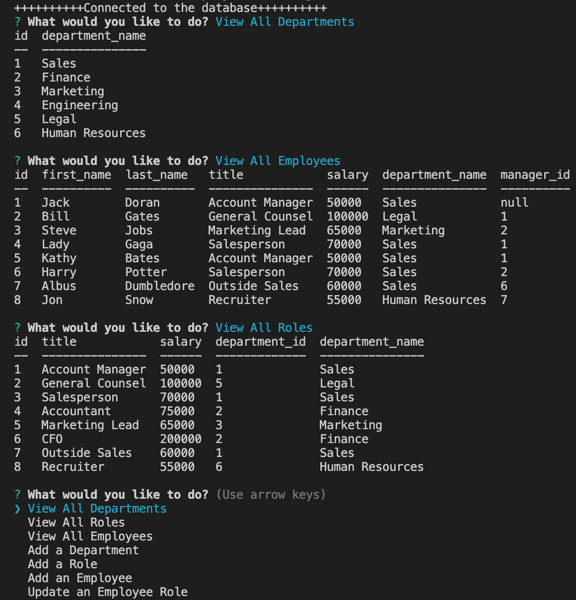

# Employee-Tracker

## Summary

This application is a miniature content management system, used to view, add to, and update a database of employee information. The user can view all employees, departments, and roles along with relevant information like salary or manager. The user can also add a new employee, role, or department to the database. There is also an option to update a current employee's role in the database.

## Packages Used

This application uses [Node.js](https://nodejs.org/en/). [MySQL(2)](https://www.npmjs.com/package/mysql2) was used to enable query from and writing to the database. The [console.table package](https://www.npmjs.com/package/console.table) was used to render tables cleary in the command terminal. [Express.js](https://expressjs.com/) is used for routing, and the [Inquirer](https://www.npmjs.com/package/inquirer) package was used for prompting the user with questions.

## Screenshot

## Link to Screencapture of Application in Action

[Google Drive Link to Screencapture Video](https://drive.google.com/file/d/1onR5qpbkEMgzuforNjmK541uWih9Fafi/view?usp=sharing)

## Link to Github Repository

[Github Repository](https://github.com/jcdoran33/Employee-Tracker)